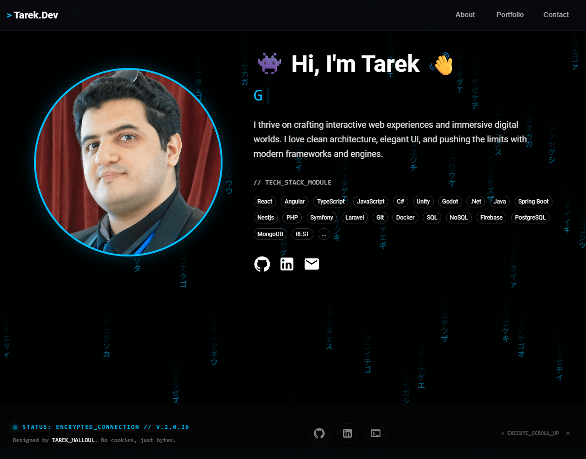

# 💼 Tarek.dev — Full-Stack Developer Portfolio

A high-performance, cyberpunk-inspired developer portfolio. This system features a **React/TypeScript** frontend and a specialized **.NET 8** backend designed for secure communication and dynamic project synchronization.



---

## 🚀 System Features

- ⚡ **Dynamic Repository Sync**: Seamless integration with GitHub API to fetch live project data.
- 📬 **Secure Contact Gateway**: A dedicated **.NET Web API** for handling encrypted message transmissions.
- 🛡️ **Rate Limiting Protection**: Backend security that prevents spam by limiting uplink requests (3 per minute).
- 🖼️ **Adaptive Image Loading**: LFS-aware image fetching with automatic **Socialify** fallback.
- 🎨 **Modern Cyber-Aesthetic**: Custom-themed Material UI with glowing glassmorphism and terminal-style typography.

---

## 🛠️ Technical Arsenal

### Frontend (React/TS)
| Tool | Capability |
| :--- | :--- |
| **React 18** | Component-based UI architecture |
| **TypeScript** | Strict type-safety across the interface |
| **Material UI** | Advanced styling and responsive grid systems |

### Backend (Portfolio.Backend)
| Tool | Capability |
| :--- | :--- |
| **.NET 8 / ASP.NET Core** | Modern, high-performance API framework |
| **FluentEmail** | Clean, fluent abstraction for SMTP transmissions (Gmail) |
| **Fixed Window Limiter** | Security middleware to regulate traffic flow |
| **CORS Policy** | Secure cross-origin resource sharing for local development |

---

## ⚙️ Development Progress

- [x] **Secure Uplink**: Integrated **Portfolio.Backend** for contact form handling.
- [x] **Spam Prevention**: Implemented `.AddRateLimiter` to protect the SMTP gateway.
- [x] **GitHub LFS Resolution**: Fixed image pointer issues for high-res repository previews.
- [x] **Global Styling**: Finished the "Terminal" aesthetic for all project cards and details.

---

## 📦 Local Deployment

### 1. Backend Setup
```bash
cd Backend/Portfolio.Backend
# Add your SmtpSettings to appsettings.json
dotnet restore
dotnet run
```
### 2. Frontend Setup
```bash
npm install
npm run dev
```
